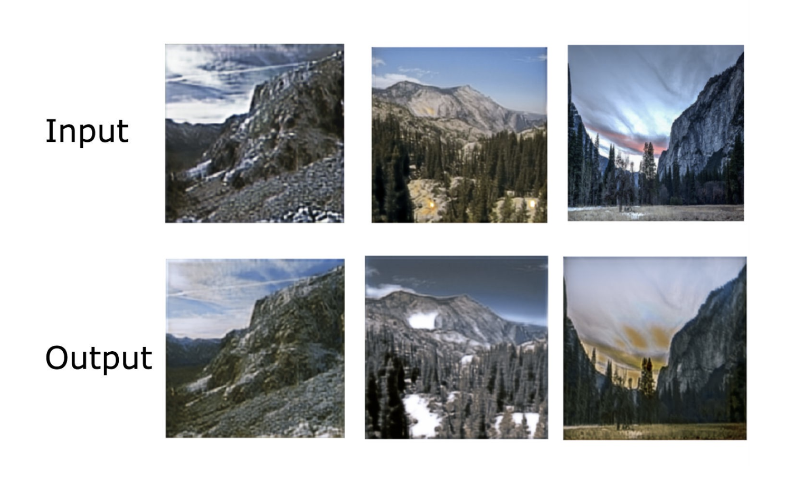
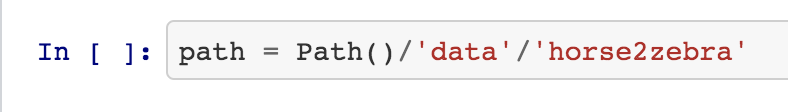
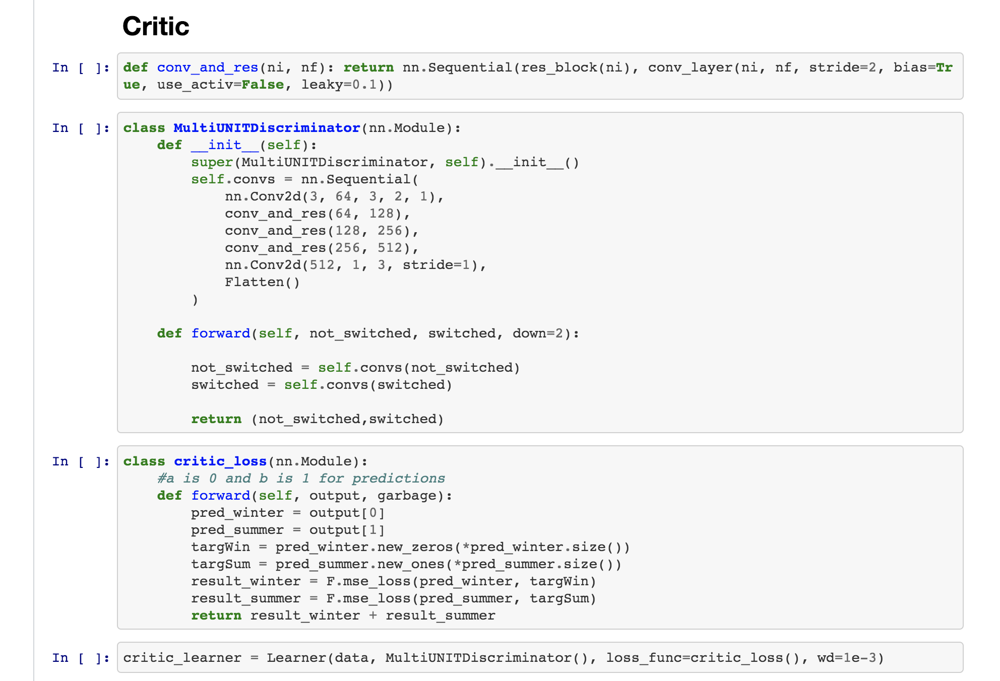

# UNET-UNIT
A modified machine learning architecture for very fast image 2 image translation, based primarily off of NVIDIA's UNIT
For a full explanation please see: https://medium.com/@theehiproject/unet-unit-for-fast-unsupervised-image2image-translation-using-fastai-e366408eddb4

## Using the architecture
1. Point path variable to folder with data. Data should be seperated into two different folders (one for domain A, one for domain B)

2. Run each cell until you get to the critic, uncommon the learn.fit line to train critic on your dataset. After critic training is done, save it and load the critic. (This is a one time step per dataset)

3. Run the rest of the cells to train your image translator!

