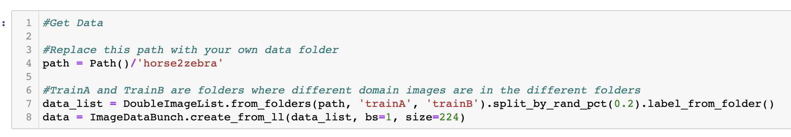
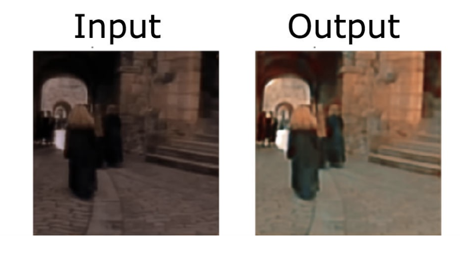

# UNET-UNIT
> A modified deep learning architecture for very fast image 2 image translation, based primarily off of NVIDIA's UNIT


# UNET-UNIT
> A modified deep learning architecture for very fast image 2 image translation

## What is a UNET-UNIT??

Great question! The goal of the architecture is to take images that are in different domains such as summer/winter, zebra/horses and learn a mapping from one image to another. A full explanation of the architecture can be found [here](https://medium.com/@theehiproject/unet-unit-for-fast-unsupervised-image2image-translation-using-fastai-e366408eddb4)
## How to use

1. Clone the repo: 
```https://github.com/BradleyBrown19/UNET-UNIT.git```

2. Open notebook Train.ipynb 

3. Change path variable to location of dataset
> Dataset should be organized by having a folder containing two directories called TrainA, TrainB


4. Run the rest of the cells and watch the magic happen!

## Some results
> After 2 epochs of training, approximately 5k iterations




## Credits

This architecture is based off of [NVIDIA's UNIT](https://github.com/mingyuliutw/UNIT/tree/25e99afe267df6eea2c97d23b05a42683d75e53c) and lots of inspiration was drawn from the [fastai library](https://www.fast.ai/).
